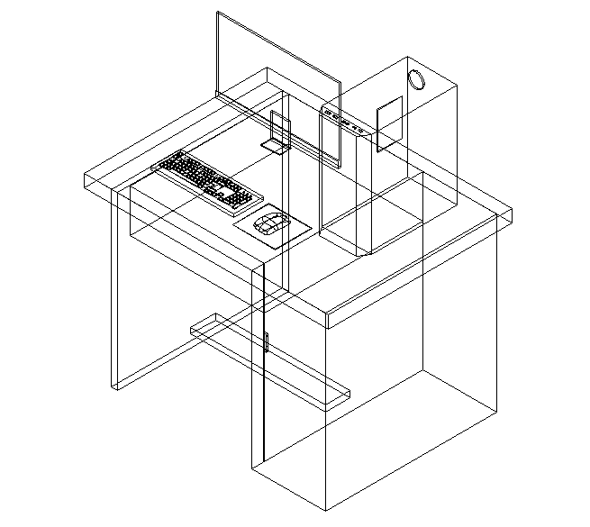
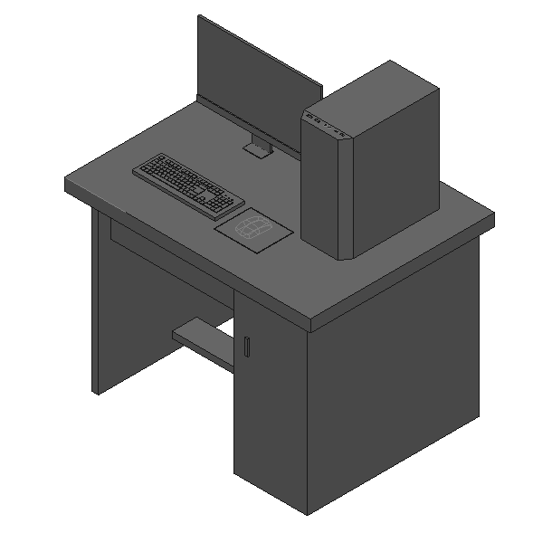

# Autocad-Practice

Some practices I have done while learning AutoCAD. This file is a CAD drawing created in the DWG format. It contains detailed architectural or engineering design elements for the [insert specific design or project name], created on [insert date if known]. The file can be opened and edited with AutoCAD or compatible CAD software.

## Software Requirements:

To view and edit this DWG file, you will need a CAD software that supports the DWG format. Below are some of the recommended software options:

- **[AutoCAD](https://www.autodesk.com/products/autocad/overview)**: Download AutoCAD
- **[FreeCAD](https://www.freecadweb.org/)**: Download FreeCAD
- **[LibreCAD](https://librecad.org/)**: Download LibreCAD
- **[DWG TrueView](https://www.autodesk.com/products/dwg)** (for viewing only): Download DWG TrueView

## Usage Instructions:

- **Opening the File**: Use any compatible CAD software as listed above.
- **Editing the Drawing**: If editing is required, ensure that you have a licensed or open-source CAD software that supports DWG files.
- **File Integrity**: Ensure that you maintain the integrity of the layers, scales, and dimensions within the DWG file while editing.

---

## Project:

Here are some sample screenshots of my AutoCAD practice projects:

### Project Screenshots

---

## Offline Series:

### Offline 1

### Offline 2

### Offline 3

### Offline 4

### Offline 5

### Offline 6

### Offline 7

---

## Online Series:

### Online 1

